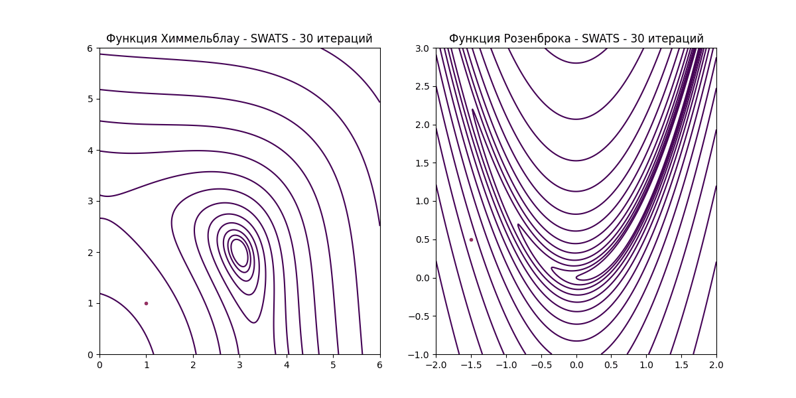

## 3. От градиентного спуска к SWATS
Рассмотрим следующую задачу:
$$Q(w)\rightarrow \min_{w\in W}, Q:W\rightarrow \mathbb{R}$$
Для временного удобства положим $W=\mathbb{R}^n$, хотя мы и хотим рассматривать $W=St(p,n)$.

Зачастую аналитическое решение такой задачи является сложным вычислительно(может быть даже NP-полным), поэтому будем искать его приближенно.

Один из методов поиска такого приближения - __GD__(Gradient Descent), стандартную итерационную формулу которого можно получить или через свойство градиента как направления наискорейшего роста функции в точке, или через непосредственное применение условий первого порядка к локальной аппроксимации целевой функции рядом Тейлора:
$$Q(w)=Q(w_0)+\nabla Q(w_0)(w-w_0)+\frac{1}{2}(w-w_0)^t\nabla^2Q(w_0)(w-w_0)+\overline{o}(||w-w_0||^2)$$
$$\nabla Q(w)=0$$
$$\nabla Q(w)=\nabla Q(w_0)+\nabla^2Q(w_0)(w-w_0)=0$$
Если положить $\nabla^2=E$, то получаем
$$0=\nabla Q(w_0)+w-w_0$$
И преобразуем для искомого вида:
$$w=w_0-\nabla Q(w_0)$$

---
__Когда следует останавливаться?__

Существует множество условий, среди которых:
- $|Q(w_k)-Q(w_{k-1})|<\epsilon, \epsilon=const$
- $|w_k-w_{k-1}|<\epsilon$
- $|\nabla Q(w_k)|<\epsilon$
- $k>N=const$ и т.п.
Если не оговаривается противное, будем считать, что подразумевается второе:
$$|w_k-w_{k-1}|<\epsilon$$
Его легко интерпретировать и оно не требует вычисления значения функции в точке.

В своей стандартной форме __GD__ имеет ряд недостатков, одним из которых является зависимость шага исключительно от градиента в точке, но не от номера итерации.

Решением является введение параметра шага:
$$w_k=w_{k-1}-\eta_k\nabla Q(w_{k-1})$$
---
__Как выбирать параметр?__

Если имеет место липшицевость, что равносильно ограниченному изменению производной, то имеет смысл взять $n_k=\frac{1}{L}=const$, где $L$ находится из $||Q(x)-Q(y)||\leq L||x-y|| \space \forall x,y \in W$.
_Примечательно_, что с выпуклостью функции выполнение липшицевости зачастую может гарантировать сходимость __GD__.

Альтернативный подход к параметру $\eta_k$ применяется в __Momentum__(GD with Momentum):
$$w_{k} = w_{k-1} - \eta_k g_{k}, \space g_{k}=\beta g_{k-1}+(1-\beta)\nabla Q(w_{k-1}), \beta\in(0,1)$$

Интуиция следующая: на каждом шаге мы учитываем не только текущее направление роста, но и инерцию, накопленную шагами до этого, при этом чем больше номер итерации, тем меньше влияют первые шаги. Обычно $\beta\in[0.001, 0.1]$.

Эта идея развивается в методе __NAG__(Nesterov Accelerated Gradient):
$$w_{k} = w_{k-1} - g_{k}, \space g_{k}=\beta g_{k-1}+\eta_k\nabla f(w_{k-1}-\beta g_{k-1})$$

Так мы не только учитываем накопленную инерцию, но и сразу подставляем будущее значение(look-ahead).

Еще одним подходом является подбор шага как адаптивной величины, что дает постепенную сходимость без резких скачков, как в GD или NAG.
Такая стабильность необходима ввиду следующего: вычисление градиента даже с помощью трюков типа автоматического дифференцирования является крайне затратным, зачастую берется "шумный" градиент, полученный как среднее случайной выборки аргументов(mini-batch):
$$\nabla Q_B(w_B)
= \frac{1}{|B|} \sum_{i \in B} \nabla Q_i(w_i)$$
Именно устойчивость к резким изменениям обеспечивает корректность работы адаптивных оптимизаторов на "шумных" градиентах.

Так, __RMSProp__(Root Mean Square Propagation) накапливает квадраты инерций и нормирует каждый градиент покомпонетно через деление на корень их накопленной суммы, причем в этой сумме инерции затухают экспоненциально для меньшего вклада первых шагов со временем:

$$\begin{align*}
    &g_{k.j} = \beta g_{k-1,j} + (1-\beta)(\nabla Q(w_{k-1}))_j^2;\\
    &w_{k,j} = w_{k-1},j - \frac{\eta_k}{\sqrt{g_{k,j} + \epsilon}} \nabla Q(w_{k-1})_j.
\end{align*}$$

Если объединить идею адаптивного шага и Momentum, то получится крайне популярный адаптивный оптимизатор __ADAM__(Adaptive Moment Estimation):
$$
g_{k} = \nabla Q(w_{k-1})
$$

$$
m_k = \beta_1 m_{k-1} + (1 - \beta_1)\, g_k
$$

$$
v_k = \beta_2 v_{k-1} + (1 - \beta_2)\, g_k^2
$$

$$
\hat{m}_k = \frac{m_k}{1 - \beta_1^k}
\qquad
\hat{v}_k = \frac{v_k}{1 - \beta_2^k}
$$

$$
w_{k} = w_{k-1} - \eta_k\, \frac{\hat{m}_k}{\sqrt{\hat{v}_t} + \epsilon}
$$

Как можем видеть, в нем есть и инерция для шага по каждой координате, и адаптивная нормировка градиента за счет накопления инерции квадратов предыдущих шагов.

Иной подход предлагает семейство стохастических оптимизаторов, которые итерируются как классический GD, но вместо градиента берется или случайная координата или mini-batch, что ускоряет вычисления, но в то же время значительно увеличчивает число итераций.
Так, в __SGD__(Stochastic Gradient Descent):
$$w_{k} = w_{k-1} - \eta_k\, \nabla_i Q(w_{k-1})$$

_Примечательно_, что если опустить параметр $\eta_k$, то SGD (гарантированно!) не сойдется: вблизи минимума каждая новая взятая случайная координата будет перетягивать шаг на себя, ввиду чего получается бесконечное блуждание в окрестности искомого $argmin$.

---

Резюмируя обзор различных модификаций GD, важно отметить, что каждый из методов преследует отдельную цель и может показывать себя лучше альтернативных методов на _своей специально подобранной задаче_, поэтому часто полезен синтез уже существующих методов, решающий _специфицескую задачу_.
Так, может пригодится SGDM=SGD+Momentum, или NADAM=NAG+ADAM, или в целом идейно новый подход(Polyak Heavy Ball и тп.)

---

Как было упомянуто, часто мы берем не весь градиент, а среднее случайной выборки или вообще единственную случайную координату. Ввиду этого особо популярны именно стохастические и адаптивные методы: первые непосредственно решают задачу со случайной координатой на входе, вторые же делают шаг постепенным и стабильным, независимо от входных данных, сохраняя инерцию направления.
На практике упомянутая инерция позволяет достичь больших шагов, чем у SGD, в начале, но в конца она наоборот вредит: при большом количестве шагов аккумулирование информации о предыдущих вызывает преждевременное по сравнению с SGD выполнение условия остановки, что означает худшее приближение решения задачи минимизации.

Эта проблема решается оптимизатором SWATS, который сперва использует ADAM, совершает на каждом шаге проверку на вырождение инерции, а после вырождения -  переходит на SGDM, делая "проекцию" инерции ADAM на параметр инерции SGDM.

Итак, __SWATS__(Switching from ADAM to SGD):
1. ADAM
	Мы начинаем с описанного выше ADAM
$$
g_{k} = \nabla Q(w_{k-1})
$$

$$
m_k = \beta_1 m_{k-1} + (1 - \beta_1)\, g_k
$$

$$
v_k = \beta_2 v_{k-1} + (1 - \beta_2)\, g_k^2
$$

$$
\hat{m}_k = \frac{m_k}{1 - \beta_1^k}
\qquad
\hat{v}_k = \frac{v_k}{1 - \beta_2^k}
$$
$$
w_{k} = w_{k-1} - \eta_k\, \frac{\hat{m}_k}{\sqrt{\hat{v}_t} + \epsilon}
$$
2. "Проекция" и переключение
	__Когда мы хотим переключиться на SGDM?__
	SGDM имеет вид:
	$$
	v_k=\beta\,v_{k-1}+\hat{\nabla}f(w_{k-1})
	$$$$
	w_k=w_{k-1}-\gamma_{k-1}\,v_k.
	$$
	То есть шаг SGDM: $p^{SGDM}_k=-\gamma_{k-1}\,v_k$
	Соответственно шаг SGD: $p^{SGD}_k=-\gamma_{k-1}\,g_k$
	Итак, для ответа на вопрос выше попытаемся примерно оценить, какая накопленная инерция была бы у SGDM на данный момент, если бы мы итерировались этим методом, вместо шага ADAM: $p^{ADAM}_k=-\eta_k \,\frac{\sqrt{1-\beta_2^k}}{1-\beta_1^k}\,\frac{\beta_1 m_{k-1}+(1-\beta_1)\nabla Q(w_k)}{\sqrt{\beta_2 v_{k-1}+(1-\beta_2)(\nabla Q(w_k))^2}+\varepsilon}.$
	Иными словами, мы хотим иметь "проекцию" накопленного $p^{ADAM}_k$ на теоретический $p^{SGDM}_k$
	Для этого сперва оценим более простой шага $p^{SGD}_k$, а далее экстраполируем через усреднение, то есть
	$$p^{ADAM}_k\rightarrow p^{SGD}_k \rightarrow p^{SGDM}_k:$$
	$$p^{SGD}_k\approx p^{ADAM}_k$$$$-\gamma_{k-1}\,g_k\approx p^{ADAM}_k$$
	Из предположения приближенного равенства домножим на $(p^{ADAM}_k)^t$
	$$-\gamma_{k-1}\,(p^{ADAM}_k)^tg_k\approx (p^{ADAM}_k)^tp^{ADAM}_k$$
	$$\gamma_{k-1}\,\approx -\frac{(p^{ADAM}_k)^tp^{ADAM}_k}{(p^{ADAM}_k)^tg_k}$$
	Так мы получили параметр шага SGD, сделаем экстраполяцию на SGDM.
3. Усреднение
	 Из-за присутствия у ADAM усреднения учтем его и для SGDM:
	$$
	\lambda_k=\beta_2\,\lambda_{k-1}+(1-\beta_2)\,\gamma_k.
	$$
	Сейчас мы получили "проекцию" шага на SGD с инерций.
	Далее отнормируем "bias", поскольку и ADAM делает так с инерциями:
	$$\Lambda=\frac{\lambda_k}{1-\beta_2^k}$$
	Все операции выше можно воспринимать как "непрерывное" продолжение инерции ADAM на SGDM.
	В итоге мы получили приближенную проекцию $p^{ADAM}_k$ на $p^{SGDM}_k$.

4. Остановка
	Будем останавливаться, когда "проекция" на SGD будет слабо отличаться на "проекцию" SGDM.
	Как пишут авторы, этот результат скорее эмпирический, но и его можно интерпретировать как некоторую точку "непрерывной склейки" двух оптимизаторов.
$$
	\left|\frac{\lambda_k}{1-\beta_2^k}-\gamma_k\right|<\varepsilon.
	$$
5. SGDM
	Получив $\Lambda$, используем его как параметр шага в SGDM:
$$\Lambda=\frac{\lambda_k}{1-\beta_2^k}$$
$$
	v_k=\beta\,v_{k-1}+\hat{\nabla}f(w_{k-1})
	$$$$
	w_k=w_{k-1}-\Lambda\,v_k.
	$$
	
